# NYC Citibike Bikesharing

## Overview

Inspired in the NYC *Citibike* bike-sharing program, Kate and I are proposing the launch of a similar program in our hometown of Des Moines, Iowa. As interested angel investors, we would like to share with you our key findings on the *Citibike* program data, in order to better understand how a similar program can be successful in Des Moines.

Des Moines has a relatively flat geography, with plenty of riding trails. More importantly, it is below the national average in commute times (on average between 5 - 25 minutes), yet only 0.2% of commuters are using bikes as a mode of transportation, which is one-third the national average (source: https://www.bestplaces.net/transportation/metro/iowa/des_moines-west_des_moines). 

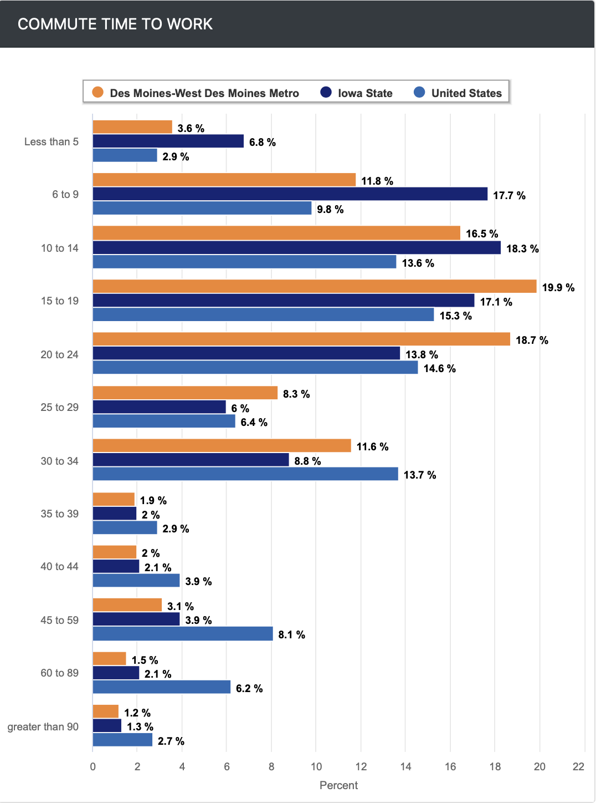

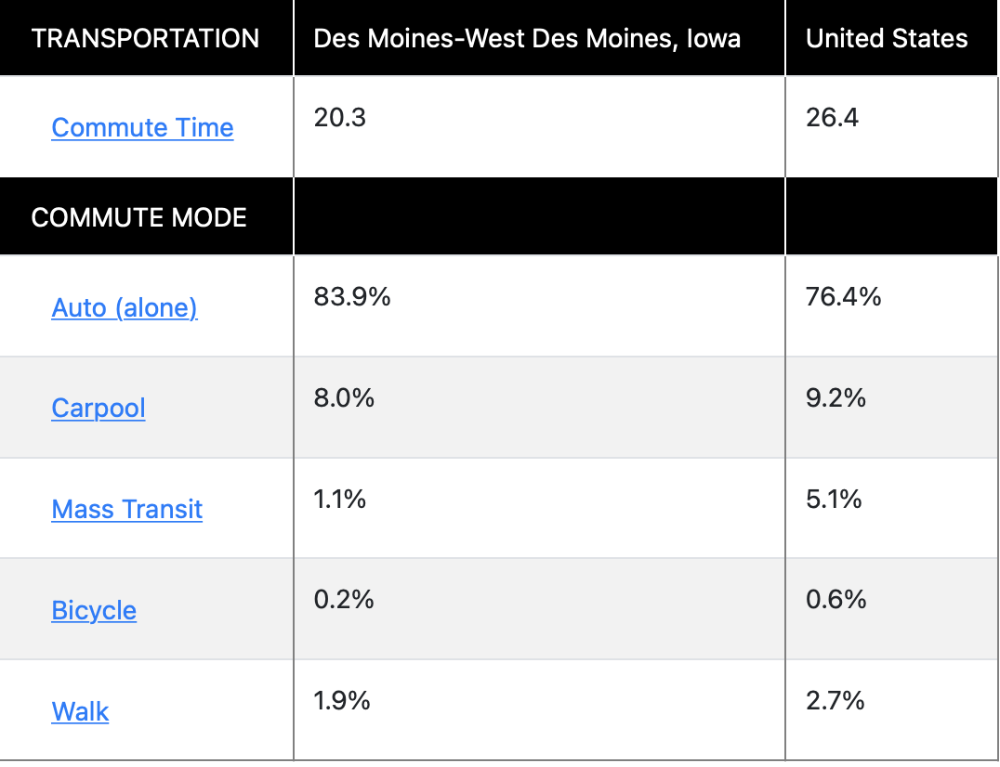

Equally important, the average population age in Des Moines is relatively young, with an average age of 33 years according to the latest U.S. Census.

As you will appreciate, the Citibike program's success is likely based on a subscription plan attractive to city commuters with short duration trips, to and from work. It also adds the added benefit of providing visitors with an easily and enjoyable mode of transportation to visit city sights.

### Methodology

Our analysis is based on data made publicly available online by the Citibike program (*https://ride.citibikenyc.com/system-data*). We chose the dataset for the month of August, 2019. This data was imported into a *jupyter notebook*, where we used the *pandas* library to add *datetime* format to ride durations, to better analyze the data. We retained the integer format of the ride durations (expressed in seconds), so that we can use it for additional analysis.

Our analysis is presented in an accompanying *Tableau* public file, with a series of relevant worksheets, dashboards, and a story.

The *Tableau* file is available on this link [link to dashboard](https://public.tableau.com/app/profile/ignacio.guerra/viz/NYCCitibikeChallenge_16368699626060/NYCCitibikes?publish=yes "NYC Citibike Challenge").

## Results

Analysis of the data is presented in the following relevant visualizations:

#### Checkout Times for Users

As can be observed from the graph, trip durations tend to last less than an hour.

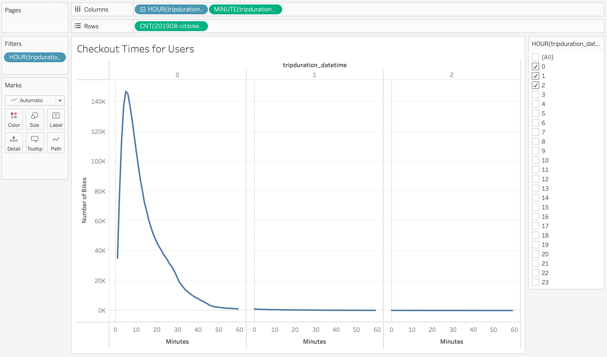

#### Checkout Times by Gender

Average trip duration is roughly 5 to 10 minutes, which suggests these cover relatively short distances. This remains the same for male as well as female riders.

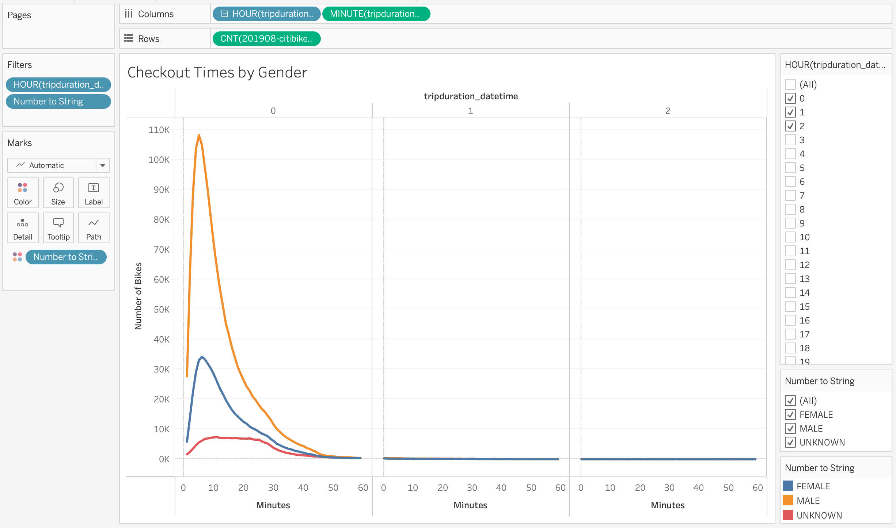

#### Checkout Times by Users

Non-subscribers tend to make longer trips that range anywhere from 5 to 30 minutes.

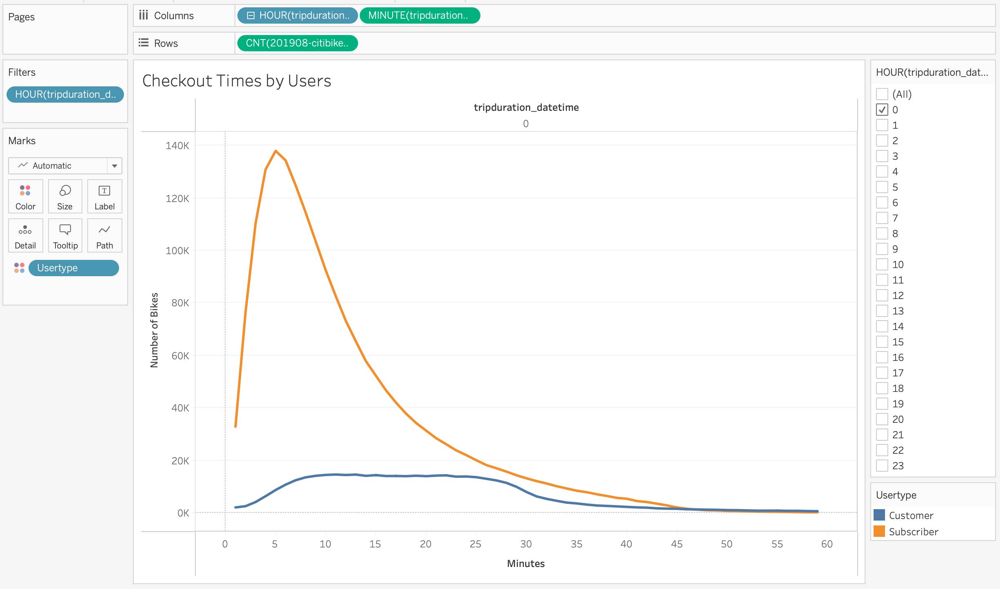

#### Trips by Weekday for Each Hour

Most trips occur on weekdays and initiate at the start of the work day or at the end of the work day, which suggests that bikes are primarily used for work commute.

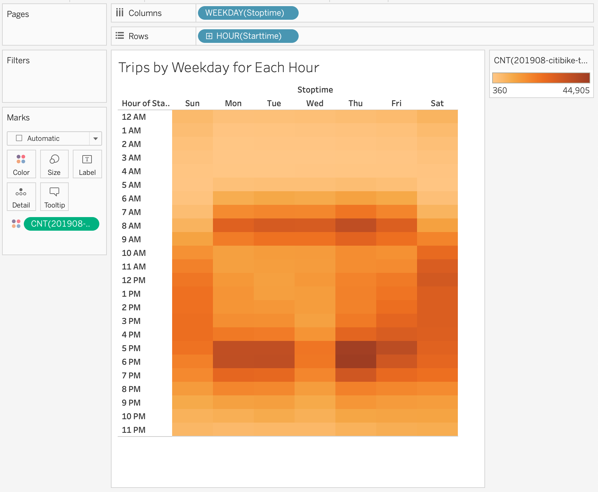

#### Trips by Gender (Weekday per Hour)

This is particularly evident among males, with Thursdays also being the peak weekday.

.png)

#### User Trips by Gender by Weekday

Male subscribers tend to be the main customers for Citibikes, and their use tends to concentrate on weekdays.

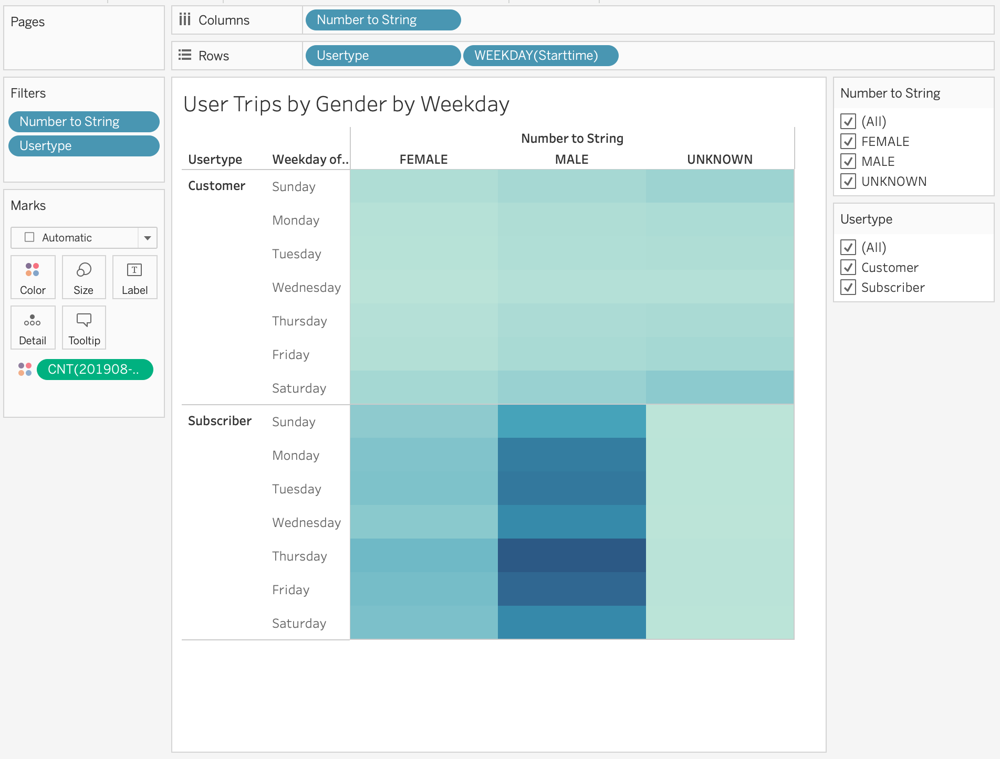

#### Trips by Age and Usertype

The typical Citibike user tends to be young adult males, followed by young adult females. Most users are subscribers. Non-subscribers (customers) tend to be younger and equally likely to be male or female and tend to make trips that are on average twice in duration as subscribers.

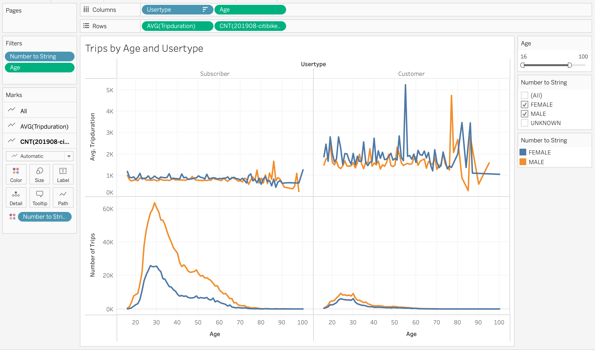

### Challenges

The project presents some challenges, however we are confident that these can be overcome through focus on operational logistics.

#### Map Dashboard - Start and End Locations with Filters

Top 20 end-station information suggests that, on any given Thursday 8:00am trip, male subscribers tend to flock from all over Manhattan to a very concentrated group of destinations along a business corridor in central Manhattan. This seems to support the hypothesis that bikes are primarily utilized for work commute. The recurring need/use would also explain the preference for subscriptions. If so, this may pose logistical issues as bikes will tend to concentrate in specific locations at certain times of the day, limiting availability for other types of users elsewhere. However, they will likely be in the proper station when needed for the commute back.

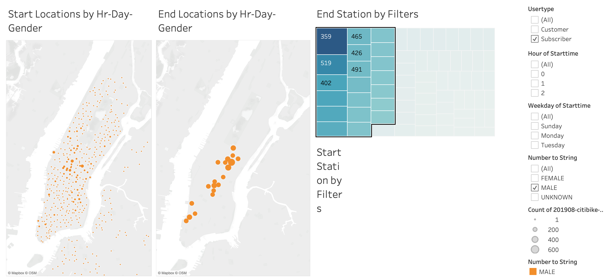

#### Bike Utilization

In addition to this logistical challenge, individual bike utilization suggests some bikes are overextended and will likely require more maintenance. With today's remote sensing technology, this can easily be monitored so that these bikes are timely relocated to stations with lower utilization.

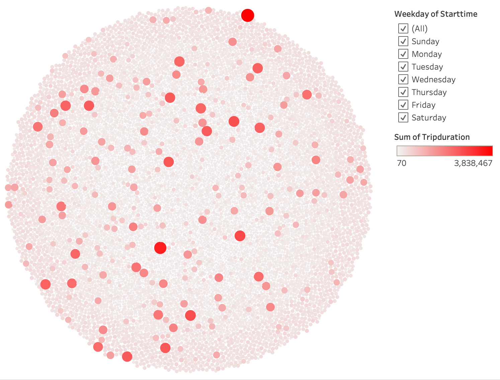

## Summary

In summary, we feel very confident that a bike riding program can be successful in Des Moines. The data validates that bikes are mostly used for short duration commutes to work by young adults. The preference of these users for a subscription plan provides an additional level of stability for the program as income streams are recurring and predictable.

We also added two visualization worksheets with filters for user type, gender and weekday, with a convenient slider for animating a map to show, in one case start station transit volumes, and in the other case end station transit volumes, during the hours of the day. This visualization tool can provide useful insights on utilization patterns for the program.

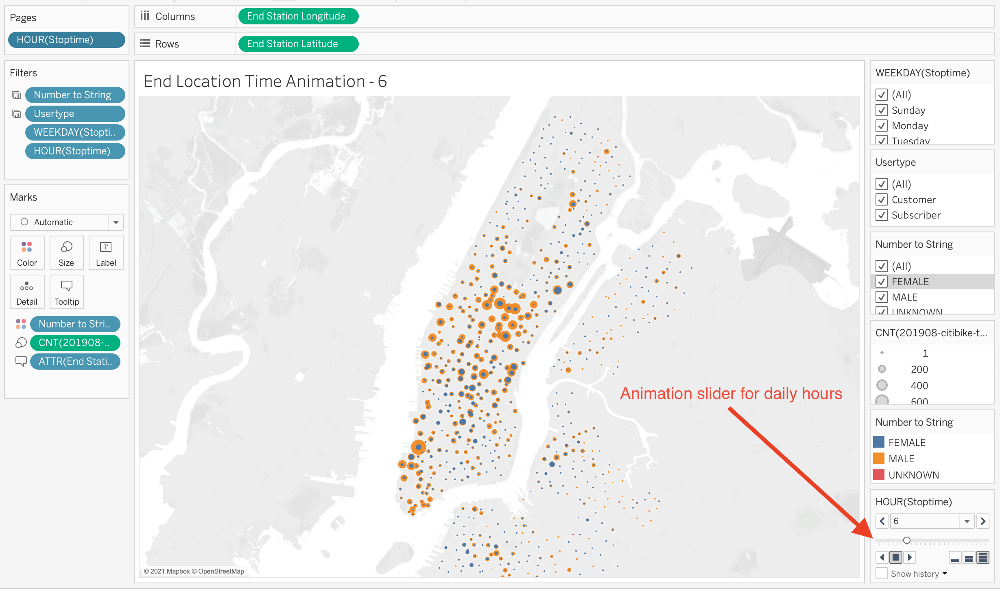

Given the data, or reverse engineering it from published rates, we would also like to conduct some further analysis on the economics of the program, in order to calculate costs per utilization rates, key income drivers, as well as breakeven analysis.

